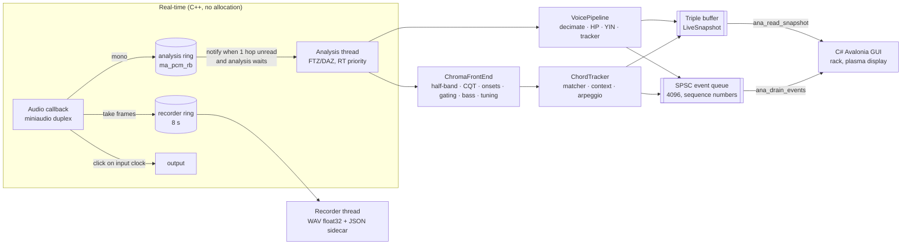

# Implementation status

What exists in the code today, how it fits together, and what was measured.
The target design is [`spec.md`](spec.md); this file describes only what is built.
`spec.v2.1.md` is the original spec, kept for history.

| Milestone | Scope | Status |
|---|---|---|
| M0 | Skeleton: device, rings, threads, snapshot, events, REC, metronome, C ABI | Done (open items below) |
| M1 | Voice / instrument melody (YIN, tracker, spelling) | Done |
| M2 | CQT engine, chroma, global tuning | Done |
| M3 | Chord templates, matching, tracker, ambiguity reasons | Done |
| M4 | Onsets, onset gating, bass, inversions, arpeggios | Done |
| M5 | Music theory: chord spelling, Roman numerals, cadences, LCD staff | Done (live cadences use harmonic evidence only) |
| M5b | Rack modules: fretboard/keyboard, waterfall, tuner, edit mode, stage mode | Partly (GUI prototype) |
| M6 | LIVE → SCORE fast path, MusicXML/MIDI, Verovio | Done except the Verovio view (SCORE shows text) |
| M7+ | STUDIO (import, editor, separation, choir, VST3) | Not started |

## Architecture as built

Only the pipeline chosen on START exists in a session (`voice_` for mono modes,
`chroma_` + `chords_` for chord modes). Nothing switches at runtime.

## Code map

| Path | What it does |
|---|---|
| `core/include/dissonancia.h` | The whole C ABI: POD structs with explicit padding, `extern "C"` functions |
| `core/src/api.cpp` | ABI entry points: handle, device list, start/stop, snapshot, events, REC, metronome, layout export |
| `core/src/engine.{hpp,cpp}` | Session lifecycle, audio callback, notify rule, analysis loop, meters, metronome, REC, take log, sidecar |
| `core/src/lockfree.hpp` | Triple buffer and SPSC queue (preallocated, never allocate) |
| `core/src/rt.{hpp,cpp}` | Denormals off, thread priority (MMCSS / SCHED_FIFO / QoS), real-time scope flag, monotonic clock |
| `core/src/live_config.hpp` | Mode × quality table: rates, hops, windows, ranges, computed T_low |
| `core/src/voice.{hpp,cpp}` | Pipeline A: FIR decimator, high-pass, YIN, median-of-3, note tracker, events |
| `core/src/theory.hpp` | Speller: key signature, chromatic spelling by direction, minor raised 6/7, letter octave, clef shift |
| `core/src/halfband.hpp` | IIR polyphase half-band decimator, analytic response, computed group delay |
| `core/src/cqt.{hpp,cpp}` | Octave-decimated CQT, 11 tuning sets, chroma with leakage removal, tuning estimator, onset gating |
| `core/src/bass.{hpp,cpp}` | Onset detector (spectral flux) and bass tracker (YIN preview + CQT confirmation) |
| `core/src/chords.{hpp,cpp}` | Chord matcher (180 harmonic-aware templates, Occam, key/cadence context, bass), tracker, slash spelling |
| `core/src/abi_check.cpp` | `static_assert` sizes/offsets, compiled with `-Wpadded -Werror` |
| `core/tests/` | Catch2 tests + `rt_trap.cpp` (operator new aborts inside a real-time scope) |
| `app/Native.cs` | P/Invoke mirrors, layout check, `NativeCore`, `NativeLiveSource`, text cache |
| `app/LiveModel.cs` | `Session`, `LiveFrame` (view model), `ILiveSource`, `FakeLiveSource` (design data) |
| `app/Rack.cs` | Rack modules: input VU under glass, scope, analyzer display, instrument, timeline, transport, status, stage |
| `app/Plasma.cs` | Gas-plasma look: 5×7 dot-matrix font, glow, lamps, pixel grid |
| `app/Theory.cs` | GUI-side pitch/key/clef helpers |
| `app/Program.cs` | Window, tabs (START / LIVE / STUDIO placeholder / SCORE), START options, shortcuts |

## What each part does

### M0 — skeleton
- miniaudio duplex (or capture-only) device, 5 ms period requested, real rate
  and period read back. The capture latency shown is what the backend reports.
- The callback only downmixes into the analysis ring, copies the take window
  into the recorder ring, mixes the metronome click, and wakes the analysis
  thread when at least one hop is unread and the thread waits.
- The analysis thread publishes a complete `LiveSnapshot` every hop through a
  triple buffer. Discrete events go through the SPSC queue with sequence
  numbers, so a dropped event shows up as a gap.
- The metronome grid lives on the input sample clock. REC arms at the next bar
  plus the count-in and forces the metronome on. REC stop is 100 ms ahead of
  the callback clock, so no block ever writes past it.
- Each take is a float32 WAV plus a JSON sidecar: session, device rate,
  input/output/compensation latency, start sample, gaps, and the complete
  note/chord events of the take (times from the first downbeat).
- Events are backdated by the round-trip latency (output + input), because
  the bar grid is where the click is generated.

### M1 — voice / instrument melody
- Integer FIR decimation to 16 or 22.05 kHz (delay compensated), high-pass at
  0.8 × f_min, YIN on an unwindowed frame. The instantaneous pitch is
  published every hop.
- The stable note comes from a median of 3, 0.7-semitone hysteresis and a
  30 ms minimum. Vibrato never splits a note. A repeated pitch after silence
  is a new note.
- Notes are backdated to the energy onset (from silence) or to the window
  centre (pitch change). The previous note ends exactly at the new onset.
- Spelling: key signature letters; chromatic notes by melodic direction (A→A♯→B,
  B→B♭→A); raised 6/7 in minor (G♯ in A minor, F𝄪 in G♯ minor); the octave
  follows the letter (C♭4 = MIDI 59); Treble 8vb clef.

### M2 — CQT, chroma, tuning
- Top octave at the live rate, each lower octave halved by the IIR half-band.
  One kernel set in normalized frequency is shared by all octaves. Each bin is
  one direct dot product (Hann, L = Q·fs/f, Q = 1.443 · bins per octave).
- Chroma removes main-lobe leakage into the neighbour bin, drops pitch classes
  20 dB below the strongest, log-compresses, smooths.
- Global tuning: the median deviation of many peaks selects one of 11
  precomputed kernel sets (−50…+50 cents), without allocation.

### M3 — chords
- Cosine similarity between chroma amplitudes and 180 templates that include
  each chord note's own partials, plus Occam penalties (strong pitch class
  missing from the template, template note absent).
- Tonal context (key set): the chord's function in the key, with separate
  major and minor tables, plus the cadence from the previous chord (V→I, V→i,
  plagal, deceptive). The context decides only what the audio leaves open.
- Ambiguity is never forced: identical pitch-class sets (C6 ≡ Am7), symmetric
  chords, missing thirds are flagged with a reason shown on the display.
- Tracker: preview every hop; confirmation after 0.4 s (0.6 s HighPrecision)
  from the onset; passing tones cancel; the previous chord ends at the new
  onset; silence closes the chord.

### M4 — onsets, bass, inversions, arpeggios
- Onsets: log spectral flux over the top 3 CQT octaves, adaptive threshold,
  80 ms refractory period.
- Onset gating: a bin whose window still reaches before the last onset is
  excluded from chroma and bass until it refills.
- Bass: YIN preview on the cascade's own decimated low octave; CQT
  confirmation on ungated bins; settled after the computed T_low with the
  preview agreeing (an octave-below sub-harmonic counts).
- A settled bass resolves identical sets and gives inversions. The slash note
  is spelled as a chord tone (E/G♯, D/F♯). Events carry the inversion index.
- Arpeggio accumulator: a decaying max-hold used only for sparse frames, so
  strummed changes are never smeared.

### M5 — music theory
- Key cascade, key-signature spelling, chord symbols with key-aware roots and
  chord-tone slash basses, LCD mini staff (from M1–M4).
- Roman numerals on every candidate and chord event (`roman`, ASCII in the
  ABI, shown as ♭ ♯ ° ø): case by the third, `o` / `+` / `h` for dim / aug /
  half-dim, `M7`, figured bass for inversions (6, 64, 65, 43, 42), applied
  chords (`V/V`, `V65/V`, `viio7/ii`), accidentals against the key's scale
  (`bVII`, `bII`). Minor accepts the raised leading tone (V, viio7).
- `DiatonicStatus` per chord: diatonic, applied dominant, borrowed from the
  parallel mode (plus the Neapolitan), otherwise unknown. Never an error.
- Cadence events (`AnalyzerEventType::Cadence`, `CadenceEvent`): perfect /
  imperfect authentic (root position of both chords decides), plagal,
  deceptive on arrival; half and Phrygian when silence ends the phrase. LIVE
  has no melody or phrase analysis, so confidence is capped at 0.75 and the
  evidence text says what was used. Metric position and melody come in POST.
- Sidecar: chords carry `roman`, `diatonicStatus`, `inversion`; cadences are
  written as their own entries.
- GUI: Roman numeral and last cadence on the analyzer display, numerals under
  each timeline cell; a `ChordEnded` replaces the timeline cell, so a bass
  that settles after the confirmation still shows its inversion.

### M6 — LIVE → SCORE (`app/Score.cs`)
- Source: the REC take's JSON sidecar. Event times are seconds from the
  first downbeat, round-trip compensated; bar lines come from the session
  meter and BPM, never from the audio.
- Quantization: 12 divisions per quarter. Each quarter takes the sixteenth
  grid, or the eighth-triplet grid when its note boundaries fit it clearly
  better. Chords snap to eighths. A melody note is cut by the next one; one
  that snaps onto another replaces it. Notes held before the first downbeat
  start at the downbeat.
- Notation (§19): a note crossing a bar line or a chord change is split and
  tied. Sub-beat values stay inside their beat; longer values start on a
  beat; 4/4 and 12/8 never hide the middle of the bar (beat 2 → 4 is quarter
  + tied quarter); compound meters group in dotted beats; empty bars are
  measure rests.
- Two timelines: every item keeps its observed start/end next to its
  quantized position (in the JSON export).
- Writers: MusicXML 4.0 (key, meter, clef incl. 8vb, tempo, ties, tuplets,
  `<harmony>` with root/kind/bass/add9), MIDI type 1 (tempo/meter/key track,
  melody channel 1, chords channel 2 as bass + close voicing), JSON
  (`dissonancia-score/1`), text chord chart (`| C | G7/B Bbm7 | % |`) plus the
  Roman numeral line.
- SCORE tab: loads the newest take, shows key/meter/BPM, the chord chart,
  numerals, cadences and melody notes; EXPORT writes the four files next to
  the take. With no take yet it shows the LIVE timeline (fast path).

### GUI (prototype, C# / Avalonia 12.1, .NET 10)
- START: mode, quality, key cascade, clef, meter, BPM, count-in, audio
  device/rate/period/exclusive/click output.
- LIVE rack: VU under glass with a peak LED ladder, scrolling scope,
  gas-plasma analyzer display (dot-matrix chord/note/bass, lamps, staff,
  cents meter), fretboard/keyboard, chord timeline, transport (REC, 7-segment
  time and BPM, beat LEDs), status strip in ms, stage mode.
- If the native library is missing or its layout does not match, the GUI
  runs on `FakeLiveSource` and says "SIMULATED DATA".

## Measurements

From the test suite (synthetic signals, sample clock) and loopback runs on
the dev machine. Figures from a reference machine are still to come (open
item).

| What | Result |
|---|---|
| Voice time-to-first-pitch (Low / Balanced / High) | 30 / 30 / 40 ms (budget ≤ 80 ms) |
| Voice time-to-stable (Low / Balanced / High) | 55 / 50 / 60 ms (budget ≤ 150 ms) |
| Half-band group delay | 3.3 input samples per stage (≈ 4 ms whole cascade) |
| CQT cost (72 bins, 20 ms hop) | ≈ 17 µs/hop, 0.09 % of one core, ≈ 4× faster than full rate |
| CQT neighbour-bin leakage | −6.5 dB (removed in chroma) |
| Tuning estimate | within ±6 cents at 0 / +30 / −20 cents; loopback +20 → +23 |
| Chords, audio only (15 qualities × 4 roots) | 45/60 exact, the rest identical sets flagged |
| Chords with settled bass | 59/60 exact |
| Chord confirmation | 402 ms after the onset (documented 0.4–1 s) |
| Bass | first estimate 60 ms, settled 220 ms after the onset (T_low 210 ms) |
| Onsets | one per chord change, ±25 ms; chords backdated ±30 ms |
| Notify rule | ≈ 1 wake-up per hop, not per callback (≤ 110 for 100 hops / 750 callbacks) |
| Loopback (WSLg) | voice A3 → A♯3 → B3 at +0 ¢, 46–69 ms; CPU ≈ 2 % (voice), 0.16 % (chords) |

## Tests

`core/build/dz_tests`: 28 Catch2 cases. Every real-time path runs inside an
`RtScope`, and the test binary's `operator new` aborts there, so any heap
allocation in the callback or the analysis steady state fails the run.

- ABI: `static_assert` layout + `-Wpadded -Werror`; the C# side compares every
  size/offset with `ana_struct_layout()` at load and refuses to run on a mismatch.
- Engine: meters, scope, notify rule, click timing, REC (bar-aligned start,
  WAV length, sidecar, metronome lock), event queue overflow and sequence gaps,
  chord mode snapshot.
- Voice: YIN accuracy, spelling cases, onsets and budgets, vibrato, noise,
  chromatic direction, 8vb clef.
- CQT: half-band response, full-rate reference comparison, chroma, tuning,
  microbench.
- Chords: all qualities, ambiguities, key spelling, tracker timing, key/cadence
  context, bass inversions, settle timing, onsets and gating, arpeggio.
- `dotnet run --project tests/score`: SCORE checks — bar-line ties, beat
  2 → 4 rule, long notes, triplets, dotted eighth + sixteenth, harmony
  placement and chart, symbol parsing, MusicXML well-formed with ties,
  tuplets, harmony and 8vb clef, every measure full, MIDI tracks and tempo,
  sidecar loading in 3/4. A sidecar written by the core's REC test loads
  and exports end to end.
- Theory: 31 Roman numeral cases (major, minor, flat and sharp keys, applied,
  borrowed, figured bass); cadences from the tracker (authentic, plagal,
  deceptive, half, none without a key).

## Open items

- M0: RealtimeSanitizer CI (needs Clang ≥ 20); metronome on a different output
  device (per-beat re-anchoring); rtkit on Linux; page-fault counter; reference
  machine; loopback latency calibration (the capture figure is reported, not
  measured).
- Voice: SIMD / FFT YIN only if a measurement asks; legato repeated notes need
  an attack detector in the voice pipeline.
- Chords: NNLS chroma (M7c); guitar voicing tie-break; fretboard dots from real
  data.
- GUI: text rendering still allocates per frame outside the cached strings
  (spec §22.7); rack edit mode; waterfall.
- SCORE: Verovio view (LGPL, separate dynamic library) not integrated, the tab
  shows text; MusicXML not yet validated against the XSD in CI or opened in
  MuseScore; triplets only as eighth triplets; no tempo detection (the
  session BPM is used).
- Windows build and run not yet verified (developed on WSL2).

## Knowledge graph

`graph/` holds a [graphify](https://github.com/safishamsi/graphify) knowledge
graph of the code and docs: [`graph/GRAPH_REPORT.md`](graph/GRAPH_REPORT.md)
(god nodes, communities, surprising links) and `graph/graph.html`
(interactive; open it in a browser). Rebuild with `/graphify .` or
`graphify update .` for code-only changes.
