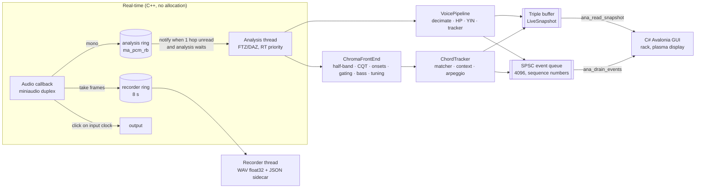

# Implementation status

What exists in the code today, how it fits together, and what was measured.
The target design is [`spec.md`](spec.md); this file describes only what is built.
`spec.v2.1.md` is the original spec, kept for history.

| Milestone | Scope | Status |
|---|---|---|
| M0 | Skeleton: device, rings, threads, snapshot, events, REC, metronome, C ABI | Done (open items below) |
| M1 | Voice / instrument melody (YIN, tracker, spelling) | Done |
| M2 | CQT engine, chroma, global tuning | Done |
| M3 | Chord templates, matching, tracker, ambiguity reasons | Done |
| M4 | Onsets, onset gating, bass, inversions, arpeggios | Done |
| M5 | Music theory: chord spelling, Roman numerals, cadences, LCD staff | Done (live cadences use harmonic evidence only) |
| M5b | Rack modules: fretboard/keyboard, waterfall, tuner, edit mode, stage mode | Done (reorder by buttons, not drag) |
| M6 | LIVE → SCORE fast path, MusicXML/MIDI, Verovio | Done (MuseScore round trip still to check by hand) |
| M7+ | STUDIO (import, editor, separation, choir, VST3) | Not started |

## Architecture as built

Only the pipeline chosen on START exists in a session (`voice_` for mono modes,
`chroma_` + `chords_` for chord modes). Nothing switches at runtime.

## Code map

| Path | What it does |
|---|---|
| `core/include/dissonancia.h` | The whole C ABI: POD structs with explicit padding, `extern "C"` functions |
| `core/src/api.cpp` | ABI entry points: handle, device list, start/stop, snapshot, events, REC, metronome, layout export |
| `core/src/engine.{hpp,cpp}` | Session lifecycle, audio callback, notify rule, analysis loop, meters, metronome, REC, take log, sidecar |
| `core/src/lockfree.hpp` | Triple buffer and SPSC queue (preallocated, never allocate) |
| `core/src/rt.{hpp,cpp}` | Denormals off, thread priority (MMCSS / SCHED_FIFO / QoS), real-time scope flag, monotonic clock |
| `core/src/live_config.hpp` | Mode × quality table: rates, hops, windows, ranges, computed T_low |
| `core/src/voice.{hpp,cpp}` | Pipeline A: FIR decimator, high-pass, YIN, median-of-3, note tracker, events |
| `core/src/theory.hpp` | Speller: key signature, chromatic spelling by direction, minor raised 6/7, letter octave, clef shift |
| `core/src/halfband.hpp` | IIR polyphase half-band decimator, analytic response, computed group delay |
| `core/src/cqt.{hpp,cpp}` | Octave-decimated CQT, 11 tuning sets, chroma with leakage removal, tuning estimator, onset gating |
| `core/src/bass.{hpp,cpp}` | Onset detector (spectral flux) and bass tracker (YIN preview + CQT confirmation) |
| `core/src/player.{hpp,cpp}` | STUDIO player: file decoded to memory, own output device, loop, min/max peak mipmap |
| `core/src/post.{hpp,cpp}` | STUDIO offline analysis job: whole file through the mode's pipeline, progress, cancel, take JSON out |
| `core/src/decode.{hpp,cpp}` | STUDIO whole-take chord decoding: Viterbi over the matcher's scores, segment labels, onset snap, metronome grid |
| `core/src/sidecar.hpp` | Take JSON event writer shared by the REC sidecar and the offline result |
| `app/Studio.cs` | STUDIO native wrappers (player, job), take project cache, library, edit list |
| `app/StudioRack.cs` | STUDIO tab as a 19" rack: DS-T transport, DS-L library, DS-A track recorder with the edit keys, DS-C chain + analyser |
| `core/src/tempo.{hpp,cpp}` | Tempo heard (onset-envelope autocorrelation + beat phase): beat marks on the scope only |
| `core/src/chords.{hpp,cpp}` | Chord matcher (180 harmonic-aware templates, Occam, key/cadence context, bass), tracker, slash spelling |
| `core/src/abi_check.cpp` | `static_assert` sizes/offsets, compiled with `-Wpadded -Werror` |
| `core/tests/` | Catch2 tests + `rt_trap.cpp` (operator new aborts inside a real-time scope) |
| `app/Native.cs` | P/Invoke mirrors, layout check, `NativeCore`, `NativeLiveSource`, text cache |
| `app/LiveModel.cs` | `Session`, `LiveFrame` (view model), `ILiveSource`, `FakeLiveSource` (design data) |
| `app/Rack.cs` | Rack modules: input VU under glass, scope, analyzer display, instrument, timeline, transport, status, stage |
| `app/Plasma.cs` | Gas-plasma look: 5×7 dot-matrix font, glow, lamps, pixel grid |
| `app/Theory.cs` | GUI-side pitch/key/clef helpers |
| `app/Program.cs` | Window, tabs (START / LIVE / STUDIO placeholder / SCORE), START options, shortcuts |

## What each part does

### M0 — skeleton
- miniaudio duplex (or capture-only) device, 5 ms period requested, real rate
  and period read back. The capture latency shown is what the backend reports.
- The callback only downmixes into the analysis ring, copies the take window
  into the recorder ring, mixes the metronome click, and wakes the analysis
  thread when at least one hop is unread and the thread waits.
- The analysis thread publishes a complete `LiveSnapshot` every hop through a
  triple buffer. Discrete events go through the SPSC queue with sequence
  numbers, so a dropped event shows up as a gap.
- The metronome grid lives on the input sample clock. REC arms at the next bar
  plus the count-in and forces the metronome on. By default the click plays
  only in the count-in and stops at the first downbeat of the take, so a
  microphone does not record it (`AudioDeviceConfig.clickDuringTake = 1` keeps
  it for headphones). While counting in, `recordedSeconds` is negative (time
  to REC); LIVE shows a large count-in panel with the beats left. REC stop is
  100 ms ahead of the callback clock, so no block ever writes past it.
- Each take is a float32 WAV plus a JSON sidecar: session, device rate,
  input/output/compensation latency, start sample, gaps, and the complete
  note/chord events of the take (times from the first downbeat).
- Events are backdated by the round-trip latency (output + input), because
  the bar grid is where the click is generated.

### M1 — voice / instrument melody
- Integer FIR decimation to 16 or 22.05 kHz (delay compensated), high-pass at
  0.8 × f_min, YIN on an unwindowed frame. The instantaneous pitch is
  published every hop.
- The stable note comes from a median of 3, 0.7-semitone hysteresis and a
  30 ms minimum. Vibrato never splits a note. A repeated pitch after silence
  is a new note.
- Octave-down guard: when the CMND dip at half the chosen lag is under 0.25,
  the half lag wins (a decaying or breathy note can push the true-period dip
  just over the 0.15 threshold while the double-period dip stays under it).
- Notes are backdated to the energy onset (from silence) or, on a legato
  change, to the midpoint between the last hop whose own estimate still
  showed the old note and the first showing the new one, minus half a window
  (the frames between mix both notes and read unvoiced). Legato changes now
  start +4…+9 ms from the change (were +14…+34 ms). The energy onset counts only when newer than the
  last voiced hop, so an unvoiced gap above the gate does not pull a note back
  to the start of the phrase. The previous note ends exactly at the new onset.
- Spelling: key signature letters; chromatic notes by melodic direction (A→A♯→B,
  B→B♭→A); raised 6/7 in minor (G♯ in A minor, F𝄪 in G♯ minor); the octave
  follows the letter (C♭4 = MIDI 59); Treble 8vb clef.

### M2 — CQT, chroma, tuning
- Top octave at the live rate, each lower octave halved by the IIR half-band.
  One kernel set in normalized frequency is shared by all octaves. Each bin is
  one direct dot product (Hann, L = Q·fs/f, Q = 1.443 · bins per octave).
- Chroma removes main-lobe leakage into the neighbour bin, drops pitch classes
  20 dB below the strongest, log-compresses, smooths.
- Global tuning: the median deviation of many peaks selects one of 11
  precomputed kernel sets (−50…+50 cents), without allocation.

### M3 — chords
- Cosine similarity between chroma amplitudes and 180 templates that include
  each chord note's own partials, plus Occam penalties (strong pitch class
  missing from the template, template note absent).
- Tonal context (key set): the chord's function in the key, with separate
  major and minor tables, plus the cadence from the previous chord (V→I, V→i,
  plagal, deceptive). The context decides only what the audio leaves open.
- Ambiguity is never forced: identical pitch-class sets (C6 ≡ Am7), symmetric
  chords, missing thirds are flagged with a reason shown on the display.
- Tracker: preview every hop; confirmation after 0.4 s (0.6 s HighPrecision)
  from the onset; passing tones cancel; the previous chord ends at the new
  onset; silence closes the chord.

### M4 — onsets, bass, inversions, arpeggios
- Onsets: log spectral flux over the top 3 CQT octaves, adaptive threshold,
  80 ms refractory period.
- Onset gating: a bin whose window still reaches before the last onset is
  excluded from chroma and bass until it refills.
- Bass: YIN preview on the cascade's own decimated low octave; CQT
  confirmation on ungated bins; settled after the computed T_low with the
  preview agreeing (an octave-below sub-harmonic counts).
- A settled bass resolves identical sets and gives inversions. The slash note
  is spelled as a chord tone (E/G♯, D/F♯). Events carry the inversion index.
- Arpeggio accumulator: a decaying max-hold used only for sparse frames, so
  strummed changes are never smeared.

### Chords in a real song (band mix: strummed guitar, bass, voice, drums)
Measured with `tools/loopback/mix.py` (16 bars at 96 bpm: down/up eighth
strumming where up-strums hit only the top strings, a bass line with passing
notes, a sung melody with passing and neighbour tones, kick/snare/hi-hat),
`core/build/dz_wav` (the engine's front end and tracker over a WAV) and
`tools/loopback/chordscore.py`.
- Chroma input (harmonic magnitudes): per-bin median over 3 hops (drum hits
  and attacks are short), minus a noise floor (12.5th percentile of the
  surrounding ±1 octave: a broadband hit lifts it, a chord's peaks do not),
  times a register weight (Gaussian on MIDI, centre A♯3, σ 20 semitones:
  fundamentals count more than partials, sibilance and cymbals). The bass
  tracker reads the median magnitudes (a kick is not a bass note). The
  chroma timestamp includes the median's group delay.
- Matcher: a power chord needs the absence of a third (any third ≥ 0.15 of
  the maximum rules the "5" out: a barre F has one A among six strings).
  Colour cost: triads free, sevenths 0.003–0.007, sus/6/add9/aug 0.01–0.012,
  "5" 0.015 — a melody note over a triad no longer reads as add9 or sus.
- Tracker: hysteresis — the confirmed chord holds while it is a runner-up
  within 0.04 of the best. The same root in another colour (5, sus, add9, 6,
  a seventh, another bass) needs three times the confirmation time; a
  changed third (Dm → D7) confirms at the normal speed. A candidate is
  confirmed on the mean chroma since its attack, not on its last frame; a
  chord is relabelled when it ends on its whole duration with each pitch
  class weighted by its share of strong frames (chord tones ring, a melody
  note passes) — that label goes into the take and the score.
- Display: fretboard and keyboard show the notes of the chord on display,
  held while strums and passing notes move the preview.
- Confirmation stays 0.4 s: 0.3 s read 85 % of the band mix live but with 8
  wrong confirmations instead of 6 and take labels 87 % instead of 91 %.
- Display: the analyzer shows the confirmed chord, steady; a candidate shows
  only after holding 120 ms ("→ Am?"), and the timeline's provisional cell
  likewise. The matcher's per-hop preview no longer reaches the panel.

### M5 — music theory
- Key cascade, key-signature spelling, chord symbols with key-aware roots and
  chord-tone slash basses, LCD mini staff (from M1–M4).
- Roman numerals on every candidate and chord event (`roman`, ASCII in the
  ABI, shown as ♭ ♯ ° ø): case by the third, `o` / `+` / `h` for dim / aug /
  half-dim, `M7`, figured bass for inversions (6, 64, 65, 43, 42), applied
  chords (`V/V`, `V65/V`, `viio7/ii`), accidentals against the key's scale
  (`bVII`, `bII`). Minor accepts the raised leading tone (V, viio7).
- `DiatonicStatus` per chord: diatonic, applied dominant, borrowed from the
  parallel mode (plus the Neapolitan), otherwise unknown. Never an error.
- Cadence events (`AnalyzerEventType::Cadence`, `CadenceEvent`): perfect /
  imperfect authentic (root position of both chords decides), plagal,
  deceptive on arrival; half and Phrygian when silence ends the phrase. LIVE
  has no melody or phrase analysis, so confidence is capped at 0.75 and the
  evidence text says what was used. Metric position and melody come in POST.
- Sidecar: chords carry `roman`, `diatonicStatus`, `inversion`; cadences are
  written as their own entries.
- GUI: Roman numeral and last cadence on the analyzer display, numerals under
  each timeline cell; a `ChordEnded` replaces the timeline cell, so a bass
  that settles after the confirmation still shows its inversion.

### M6 — LIVE → SCORE (`app/Score.cs`)
- Source: the REC take's JSON sidecar. Event times are seconds from the
  first downbeat, round-trip compensated; bar lines come from the session
  meter and BPM, never from the audio.
- Quantization: 12 divisions per quarter. The grid is the smallest notated
  value (START → NOTATION, like Finale's quantization settings); the default
  is the meter's beat unit (quarter in 4/4, eighth in 6/8), or quarter,
  eighth, sixteenth. With "Allow eighth triplets", a quarter takes the
  eighth-triplet grid when its note boundaries fit it clearly better. Chords
  snap to the same grid, never finer than eighths. A melody note is cut by the next one; one
  that snaps onto another replaces it. Notes held before the first downbeat
  start at the downbeat.
- Notation (§19): a note crossing a bar line or a chord change is split and
  tied. Sub-beat values stay inside their beat; longer values start on a
  beat; 4/4 and 12/8 never hide the middle of the bar (beat 2 → 4 is quarter
  + tied quarter); compound meters group in dotted beats; empty bars are
  measure rests.
- Two timelines: every item keeps its observed start/end next to its
  quantized position (in the JSON export).
- Writers: MusicXML 4.0 (key, meter, clef incl. 8vb, tempo, ties, tuplets,
  `<harmony>` with root/kind/bass/add9), MIDI type 1 (tempo/meter/key track,
  melody channel 1, chords channel 2 as bass + close voicing), JSON
  (`dissonancia-score/1`), text chord chart (`| C | G7/B Bbm7 | % |`) plus the
  Roman numeral line.
- SCORE tab: loads the newest take, shows key/meter/BPM, the chord chart,
  numerals, cadences and melody notes, and the engraved score; EXPORT writes
  the four files next to the take. With no take yet it shows the LIVE
  timeline (fast path).
- Engraving: our MusicXML goes through Verovio (`app/Verovio.cs`, P/Invoke on
  its C wrapper), one SVG per page, rasterized at 2× by Svg.Skia
  (`app/SvgRaster.cs`) on white paper. Verovio is LGPL-3.0: built by the
  core's CMake (`DZ_WITH_VEROVIO`, pinned source tarball with SHA-256) as its
  own shared library and loaded at run time, never linked into our code.
  Its text glyphs (tempo note, chord accidentals) are embedded as WOFF2,
  which Skia cannot read, so the Leipzig TTF (SIL OFL) is installed with the
  data and served by family name. Svg.Skia is pinned to 5.1.1, the last on
  SkiaSharp 3.119 (Avalonia 12's version). Without the library the tab
  shows text only and says why.

### Key, meter and tempo are the user's (`core/src/tempo.cpp`)
- No key signature by default (START → "Key signature" off): chord names
  stay plain, no roman numerals, no cadences; MusicXML gets no signature and
  no mode. Key and meter are chosen by hand by whoever knows the piece and
  never change by themselves. (A dynamic key was built and measured, then
  removed: a key that moves renames the chords under the player.)
- The session BPM (metronome, count-in, REC, bar lines of the score) is set
  by hand or by TAP.
- Tempo heard, display only: onset envelope (CQT flux in chord modes; level
  rise plus one pulse per note start in mono modes) over the last 8 s,
  smoothed over 50 ms, autocorrelated for 40–200 BPM with a log-normal
  prior around 110 BPM; half the period wins when it keeps 60 % of the
  periodicity; the period is refined over its first four multiples and
  folded into 60–180. The phase is the grid offset that collects the most
  envelope. `LiveSnapshot.context` carries BPM, confidence and the latest
  beat on the sample clock; the scope draws beat marks from it and
  TRANSPORT shows "HEARD TEMPO". No estimate when the last 2 s are silent.
- Voice and chords are separate pipelines: a mono mode runs only the YIN
  note pipeline, a chord mode only the CQT front end, matcher and tracker.
- Clef "Auto" (default for voice and melody): by the median of the notes,
  below E3 the bass clef, below C4 treble 8vb (read an octave up), else
  treble; 2 semitones of hysteresis at each boundary. LIVE follows the last
  16 notes; the SCORE uses the take's own range. The core then names notes
  as sounding (Treble), and the app shifts them for the clef shown. Guitar
  stays treble 8vb, piano the grand staff. The B2–D4 voice take of
  2026-10-02 (median G3) now engraves in treble 8vb instead of on ledger
  lines below the treble staff.
- `DISSONANCIA_TAKES` overrides the takes folder (tools, tests).
- Flow (decision 2026-10-02): LIVE → STUDIO → SCORE. TRANSPORT's button goes
  to STUDIO; the score is made from the take treated there (normalize, trim,
  EQ, Demucs separation). STUDIO is not built yet: it offers a SCORE preview
  of the raw take.

### STUDIO S1 — session (first part: library and playback)
- Core player (`ana_player_*`, its own audio context and output device,
  never shared with LIVE): WAV / FLAC / MP3 decoded to float in memory at
  the file's rate (more than two channels: the first two), play / stop /
  seek / loop [a, b), stops at the end. A peak mipmap (min/max of the mono
  mix per 256 frames, halving per level) answers the waveform at any zoom
  from the coarsest level that fits a column, or from the samples when
  zoomed in closer than 256 frames per column.
- STUDIO tab: the seven stages in studio order (only Session active yet),
  library (REC takes from the takes folder + imported files remembered by
  path in `library.json`, never copied), waveform (click: cursor, drag:
  selection, wheel: zoom around the pointer, shift + wheel: pan), PLAY /
  STOP (space), LOOP of the selection, time readout, and the raw-take SCORE
  preview of the take open.
- Offline analysis (`ana_post_*`): a worker thread decodes the file to mono
  and runs the mode's pipeline over the whole of it (voice / melody: the
  note pipeline; chords: CQT front end + tracker, chords relabelled on their
  whole duration), with progress and cancel; the result is a take JSON
  (`"analysis": "studio-offline"`, same schema as the REC sidecar, written
  by the shared `sidecar.hpp`), so SCORE loads it like any take.
- Quality: the session's. HighPrecision was measured on the band mix and is
  not better (take labels 89 % vs 91 % Balanced), so offline does not force
  it.
- Chords offline (whole-take decoding, `decode.cpp`): pass 1 keeps every
  frame's chroma, settled bass and the onsets; pass 2 runs Viterbi over the
  180 templates + silence with the matcher's acoustic scores (no tonal
  context) and a cost per change (10 summed score units), so a chord lasts
  until the harmony changes and every decision sees what follows. Each
  segment is labelled on its persistence-weighted mean chroma (normalised
  frames, a pitch class weighs by its share of strong frames), its bass is
  the settled bass that held for 30 % of it, its start the latest attack in
  the 0.25 s before the boundary, and the previous chord ends there.
  Cadences between segments as in LIVE. On a REC take the metronome grid is
  known: a change costs half on a downbeat and 1.2× off the beats.
- Notes offline (whole-take decoding, `decode_notes`): pass 1 keeps the
  LIVE pitch estimate of every hop (YIN, clarity, level) and the LIVE note
  starts; pass 2 runs Viterbi over MIDI 28–100 + unvoiced, emission
  −(Δ/0.45 st)²/2 floored at −3 and weighted by clarity, 6 per note change,
  2.5 per voiced ↔ unvoiced change; notes shorter than 80 ms are dropped;
  the same pitch across a short gap with no dip in level (a stray octave
  frame, a glitch read unvoiced) stays one note, while a sung repeat (a
  consonant dips the level) stays two; starts snap to the nearest LIVE
  onset; spelling by melodic direction in the key.
- Fixed on the way: the pitch timestamp of the first hops underflowed (an
  unsigned subtraction before the window filled) — LIVE and offline.

### STUDIO S2 — editing, and the tab as a rack
- Core (`ana_player_apply_edits`, `ana_player_save_wav`): the edited take is
  rendered from the original (never changed) — source segments in order,
  each with clip gain, 2 ms crossfades at the joins, fade in / out over the
  edited take, peak normalisation to −1 dBFS; playback, peaks and info
  follow it.
- Edit list (`EditList`, `<takes>/studio/<name>.edits.json`): APARAR (keep
  the selection), CORTAR (remove it), −3 / +3 dB on the selection, FADE IN
  (start → selection end), FADE OUT (selection start → end), NORMALIZAR,
  DESFAZER (undo stack), ORIGINAL. The analysis reads the edited take
  (written to `<name>.edited.wav`); the edit list is part of the cache key;
  the metronome grid is used only while the take still starts where the
  original did without cuts.
- The tab is the approved rack: rails, DS-T transport (keys with LEDs,
  plasma position in bars.beats.sixteenths, time, BPM, meter, loop, LEDs of
  the optional components), DS-L library on a phosphor screen, DS-A track
  recorder (tape-labelled channel card, phosphor screen with the bar ruler
  on the session grid, waveform, selection, loop, playhead, scanlines, the
  transcription lane: chord blocks in plasma or the note roll), DS-C chain
  (DS-1 … DC-5 mounted and cabled, waiting for S4, then the analyser: mode,
  ANALISAR, CANCELAR, SCORE, LED progress, plasma result).
- A REC take is analysed with its own session (mode, key, clef, meter, BPM)
  and round-trip compensation from its sidecar; an imported file with the
  START session and no compensation. The mode can be changed per file.
- Take project: `<takes>/studio/<name>-<path hash>.studio.json` holds the
  source's size and time, the options and the result path; the result is
  reused while the file and the options are unchanged ("em cache").
- SCORE from STUDIO uses the offline result; without one, a REC take's raw
  sidecar is the preview.

### GUI (prototype, C# / Avalonia 12.1, .NET 10)
- START: mode, quality, key cascade, clef, meter, BPM, count-in, audio
  device/rate/period/exclusive/click output.
- LIVE rack: VU under glass with a peak LED ladder, scrolling scope,
  gas-plasma analyzer display (dot-matrix chord/note/bass, lamps, staff,
  cents meter), fretboard/keyboard, chord timeline, transport (REC, 7-segment
  time and BPM, beat LEDs), status strip in ms, stage mode.
- If the native library is missing or its layout does not match, the GUI
  runs on `FakeLiveSource` and says "SIMULATED DATA".

### M5b — rack modules (`app/Modules.cs`, `app/RackCatalog.cs`, `app/RackLayout.cs`)
- Catalog: Analog VU + peak LEDs, Scope, Analyzer display, Tuner, Fretboard,
  Keyboard, CQT waterfall, Chord timeline, Transport, Status. Each module is
  full or half width with a height in rack units; half modules fill two
  columns, each going to the shorter one.
- Edit mode ("EDIT RACK"): move up/down, half/full width, U−/U+, remove, add
  from the catalog (modules not valid for the mode are greyed out), reset to
  the default. Locked while REC is armed or running. Transport and Status are
  pinned: they cannot be removed and sit in a bottom dock that never scrolls.
- Presets: a default per mode (Voice: Input + Analyzer, Scope, Tuner; Guitar:
  + Fretboard, Timeline; Piano: + Keyboard, Waterfall, Timeline), and the
  user's edits saved per mode as JSON (`rack-<Mode>.json` in the app config
  folder, `[{ "module": "Scope", "width": "half", "heightU": 2 }, …]`). A
  hand-edited file is cleaned on load.
- Fretboard: the likely shape computed from the detected pitch classes and
  the settled bass (`Theory.LikelyShape`, one hand position, bass on the
  lowest sounding string, no open string under an implied barre; 0.04 ms per
  chord change, only when the set changes).
- Waterfall: one column per analysis hop from the snapshot's CQT, 10 s, slow
  auto-gain, C lines labelled. Tuner: big plasma needle, ±5 ¢ lamp; chord
  modes show the estimated A4 offset. Scope: click (or the action) toggles a
  triggered view of three detected periods in mono modes.
- One action table (spec §22.6): Rec, Metronome, TapTempo, StageMode,
  LeaveStage, EditRack, Score, ScopeTrigger. Keys and transport buttons bind
  to it (MIDI later). Tap tempo (`T` or TAP) averages up to 5 taps, refused
  during REC.
- Found by the live loopback run and fixed: a chord candidate that restarted
  while its bass was settling lost its backdating (D7 started 0.36 s late);
  it now backdates to the onset that began the change. A re-strum of a
  confirmed slash chord no longer flickers to root position while the bass
  re-settles. MusicXML now writes `<accidental>` (D♭5 had none in Verovio).
- `tools/loopback`: live test through PulseAudio — `gen.py` writes the test
  WAVs, the console plays one, captures the sink monitor with the real core,
  records a take and engraves it. `mix.py` writes the band mix and its stems;
  `chordscore.py` scores `dz_wav` output against the ground truth.
- `core/build/dz_wav file.wav [guitar|piano|general]`: offline chord run over
  any WAV (a REC take, a song) with the live front end and tracker;
  `DZ_PREVIEW=1` adds the per-hop preview.
- `tools/shot`: headless screenshots of any tab and mode, optionally after
  running actions (`dotnet run --project tools/shot -- out.png 1 VoiceMono 4.2 EditRack`).
- Piano: the analyzer shows a grand staff (treble + bass joined by a system
  line); a note below C4 goes on the bass staff, C4 and above on the treble
  staff. The clef selector is disabled for piano, and the piano preset gives
  the analyzer 5U for it.
- Fixed on the way: the simulated voice computed its phase as 2π·f(t)·t with
  vibrato inside f, so its pitch drifted with time; the phase is integrated now.

## Measurements

From the test suite (synthetic signals, sample clock) and loopback runs on
the dev machine. Figures from a reference machine are still to come (open
item).

| What | Result |
|---|---|
| Voice time-to-first-pitch (Low / Balanced / High) | 30 / 30 / 40 ms (budget ≤ 80 ms) |
| Voice time-to-stable (Low / Balanced / High) | 55 / 50 / 60 ms (budget ≤ 150 ms) |
| Half-band group delay | 3.3 input samples per stage (≈ 4 ms whole cascade) |
| CQT cost (72 bins, 20 ms hop) | ≈ 17 µs/hop, 0.09 % of one core, ≈ 4× faster than full rate |
| CQT neighbour-bin leakage | −6.5 dB (removed in chroma) |
| Tuning estimate | within ±6 cents at 0 / +30 / −20 cents; loopback +20 → +23 |
| Chords, audio only (15 qualities × 4 roots) | 45/60 exact, the rest identical sets flagged |
| Chords with settled bass | 59/60 exact |
| Chord confirmation | 402 ms after the onset (documented 0.4–1 s) |
| Bass | first estimate 60 ms, settled 220 ms after the onset (T_low 210 ms) |
| Onsets | one per chord change, ±25 ms; chords backdated ±30 ms |
| Notify rule | ≈ 1 wake-up per hop, not per callback (≤ 110 for 100 hops / 750 callbacks) |
| Loopback (WSLg) | voice A3 → A♯3 → B3 at +0 ¢, 46–69 ms; CPU ≈ 2 % (voice), 0.16 % (chords) |
| Live loopback, guitar (`tools/loopback`, 8 bars G Em C D7 G/B Am7 D G, 92 bpm, plucked strings) | 8/8 chords with inversions (Guitar and Piano pipelines), starts within ±20 ms of the strums, confirmed 0.40 s after the attack, V7→I6 imperfect and V→I perfect authentic cadences, chart and numerals exact, 8 bars engraved |
| Live loopback, voice (13 notes, vibrato ±15 ¢, chromatic passing tone) | 13/13 pitches at +2…+3 ¢, D–D♭–C spelled by direction, stable-note latency median 50 ms; legato note changes started ≈ 28 ms late (now +4…+9 ms; first note after silence exact); score rhythm exact after quantization |
| Band mix, before → after (offline, `dz_wav`) | live confirmed chord correct 72.3 → 80.0 % of the time, wrong confirmations 15 → 6, matcher frames 50 → 76 %; take labels 91 %. Stems after: guitar 95 %, guitar + voice 87 % (take 94 %), guitar + bass 94 %, guitar + drums 96 %; clean plucked guitar unchanged at 99.5 % |
| Band mix, live loopback (engine, `tools/loopback`) | take labels 86 % correct |
| STUDIO offline chords vs LIVE (band mix and stems, `dz_wav … offline 96 4`) | mix 91.2 → 99.2 %, guitar 95.0 → 99.0, guitar + voice 94.0 → 99.2, guitar + bass 94.5 → 99.3, guitar + drums 97.5 → 99.2; 16 chords for 16 bars every time (LIVE: 21–37); the mix's one miss is Dm/A (passing bass read as an inversion) |
| STUDIO offline notes vs LIVE (band-mix melody, 57 notes, `dz_wav … voice … offline`) | voice alone F 100 → 100 % (onsets 4 / 7 ms); voice over the drums F 42.3 → 70.2 % (99 → 57 notes); voice under the strummed guitar 0 % in both (one pitch tracker cannot hear a voice inside chords: S3 separation's job); the 2026-10-02 voice take: 25 → 16 notes (the wobbles and the G♯5 tail gone); loopback melody 13/13 |
| STUDIO offline chords, validation (6 progressions not used for tuning: V/V + dim7, harmonic minor, B♭ jazz with tritone sub, V/vi, Neapolitan, blues) | 100 % on all six; clean plucked guitar 99.5 %, G Em C D7 G/B Am7 D G exact |
| Tempo heard, synthetic | within 2 BPM at 72/92/120/150 (10 % missing attacks, ±12 ms timing), eighth-note strumming at 92 → 92; beat phase within 30 ms |
| Tempo heard, live loopback (guitar, strums on 1 and 3, 92 bpm) | 91.5–92.3 from 3 s; beat marks hold their phase within ±15 ms over 13 s |
| Live loopback, pipeline | capture 15 ms (reported), processing median 4.8–5.1 ms, CPU ≤ 2.5 %, 0 xruns, 0 recorder gaps, 0 event gaps |

## Tests

`core/build/dz_tests`: 28 Catch2 cases. Every real-time path runs inside an
`RtScope`, and the test binary's `operator new` aborts there, so any heap
allocation in the callback or the analysis steady state fails the run.

- ABI: `static_assert` layout + `-Wpadded -Werror`; the C# side compares every
  size/offset with `ana_struct_layout()` at load and refuses to run on a mismatch.
- Engine: meters, scope, notify rule, click timing, REC (bar-aligned start,
  WAV length, sidecar, metronome lock), event queue overflow and sequence gaps,
  chord mode snapshot.
- Voice: YIN accuracy, spelling cases, onsets and budgets, vibrato, noise,
  chromatic direction, 8vb clef.
- CQT: half-band response, full-rate reference comparison, chroma, tuning,
  microbench.
- Chords: all qualities, ambiguities, key spelling, tracker timing, key/cadence
  context, bass inversions, settle timing, onsets and gating, arpeggio.
- `dotnet run --project tests/score`: SCORE checks — bar-line ties, beat
  2 → 4 rule, long notes, triplets, dotted eighth + sixteenth, harmony
  placement and chart, symbol parsing, MusicXML well-formed with ties,
  tuplets, harmony and 8vb clef, every measure full, MIDI tracks and tempo,
  sidecar loading in 3/4; every sample validates against the MusicXML 4.0
  XSD (downloaded once, cached) and imports into Verovio. A sidecar written
  by the core's REC test loads and exports end to end.
- Rack and fretboard (in `tests/score`): common open and barre shapes, preset
  cleaning and round trip, per-mode defaults, shape search timing.
- Theory: 31 Roman numeral cases (major, minor, flat and sharp keys, applied,
  borrowed, figured bass); cadences from the tracker (authentic, plagal,
  deceptive, half, none without a key).

## Open items

- M0: RealtimeSanitizer CI (needs Clang ≥ 20); metronome on a different output
  device (per-beat re-anchoring); rtkit on Linux; page-fault counter; reference
  machine; loopback latency calibration (the capture figure is reported, not
  measured).
- Voice: SIMD / FFT YIN only if a measurement asks; legato repeated notes need
  an attack detector in the voice pipeline.
- Chords: NNLS chroma (M7c); guitar voicing tie-break; fretboard dots from real
  data.
- GUI: text rendering still allocates per frame outside the cached strings
  (spec §22.7); rack reorder is by buttons, not drag and drop; one user preset
  per mode (no named presets / NextPreset yet); capo and alternate tunings for
  the fretboard.
- SCORE: open an exported take in MuseScore once (manual acceptance); no
  CI yet for the XSD/Verovio checks; triplets only as eighth triplets; no
  tempo detection (the session BPM is used); the page is re-engraved only
  when the tab opens (no reflow on resize).
- Windows build and run not yet verified (developed on WSL2).
- Voice: legato pitch changes are dated where the tracker settles (≈ 28 ms late);
  backdating them to the pitch crossing would remove it.
- The loopback runs use synthetic instruments; a real guitar and voice through
  a microphone are still to be measured.

## Knowledge graph

`graph/` holds a [graphify](https://github.com/safishamsi/graphify) knowledge
graph of the code and docs: [`graph/GRAPH_REPORT.md`](graph/GRAPH_REPORT.md)
(god nodes, communities, surprising links) and `graph/graph.html`
(interactive; open it in a browser). Rebuild with `/graphify .` or
`graphify update .` for code-only changes.
